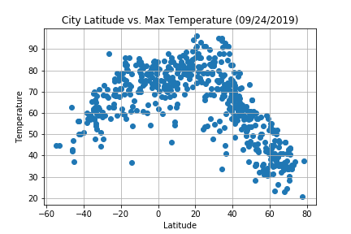
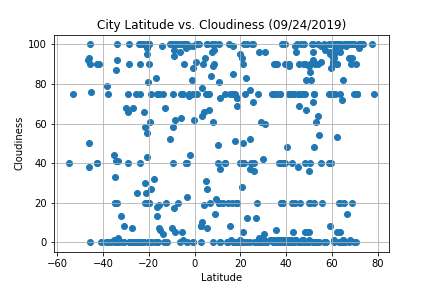
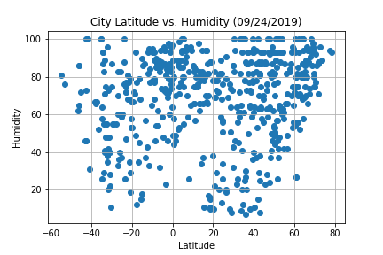
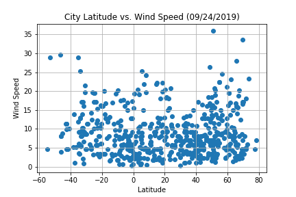

# PythonAPI

Used as a precursor for a later project, this mini-project takes predetermined Big Data and applies Python and Matplotlib concepts to discuss the effect of latitude and various categories like temperature and wind speed. More importantly, this project introduces the concept of Python APIs and JSON requests.
--------------------------------------------------------------------------------
Below are images as previews for the analysis:
--------------------------------------------------------------------------------

--------------------------------------------------------------------------------

--------------------------------------------------------------------------------

--------------------------------------------------------------------------------

--------------------------------------------------------------------------------
